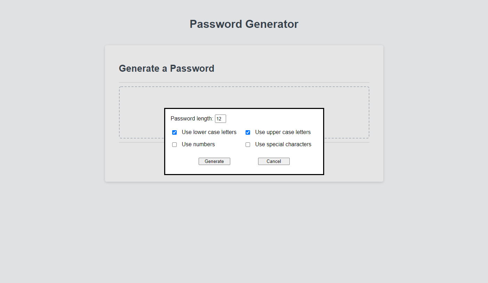

# 03 JavaScript: Password Generator

This is a random string generator meant to be used to create secure 
passwords, with some criteria such as the length and what types of 
characters to include.

I have substituted basic alerts with a pop up, so that it is easier 
to use for the end user. Warning messages are still in alerts.

## Link to live website:

https://sinsinkun.github.io/UTOR-PasswordGen

## Screenshot

